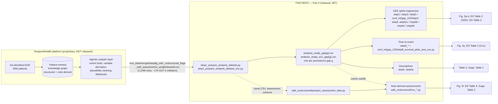

# Architecture — Part II (GLP-1 outcome analysis)

This repository is **Part II** of the code behind *Computable longitudinal patient journeys from
structured and unstructured EHR data* (Kim, Foty et al., *Nature Medicine* 2026,
doi:10.1038/s41591-026-04695-x). It is the statistical pipeline that turns one wide,
per-patient-day CSV exported from the authors' knowledge graph into the weight, HbA1c,
time-to-event and note-derived-assessment results of the paper. Part I (extraction validation)
is the sibling repository `glp1_nature2026_extraction_validation`.

## 1. Where this repo sits in the paper's system



The repo contains no data. `root_data/` and `output/` are expected siblings of `code/` at a
"study root" (`Path(__file__).resolve().parents[...]`), and every script is run from that root.
The committed files live at the repository root, so the canonical layout is
`<study_root>/code/ = this repo`.

## 2. Pipeline topology

Three cohorts × nine persistence definitions × two outcomes, driven by one runner.

```mermaid
flowchart TB
    SRC["root_data/merged/step8g_..._weightcleaned.csv"]

    subgraph phase0["Phase 0 — cohort & censoring (per gap g ∈ {30,60,90,120,150,180,365,548,730})"]
        PERS["persistence.py<br/>adherence_flags(), censor_days()"]
        S1W["step1_prepare_analysis_dataset.py<br/>weight: pct_weight_change"]
        S1A["step1_prepare_analysis_dataset_a1c.py<br/>HbA1c: abs_a1c_change"]
        PRE["structured_only/step0_prefilter_raw.py<br/>null note-derived values"]
        PERS --> S1W
        PERS --> S1A
    end
    SRC --> S1W
    SRC --> S1A
    SRC --> PRE --> S1W
    PRE --> S1A

    subgraph models["Per-gap modelling (all_data and structured_only)"]
        S2["step2_select_spline_df*.py<br/>QICu over df ∈ {3,4,5,6} → model_config.json"]
        S3["step3_fit_gee_baseline*.py<br/>main-effects GEE"]
        S4["conf_int/gap_120/step4_predictive_plots*.py<br/>per-category GEE, delta-method CI<br/>→ Fig 3a-b, ED Table 3"]
        S5["step5_forest_contrasts_*.py<br/>spline × category interaction GEE<br/>contrasts vs Normal Glycemia → ED Table 2 (GEE)"]
        S6["conf_int/gap_120/step6_stratified_by_covariates_*.py<br/>→ Fig 3c-d"]
        S6B["step6b / step6c / step6cc / step6d<br/>stratified contrasts, 3-way strata, sema vs tirz"]
        S8["step8_survival_time_to_*.py<br/>event tables 5/10/15 % and 0.5/1.0/1.5/2.0 pt"]
        S8C["conf_int/gap_120/step8_survival_plots_and_cox.py<br/>lifelines KM + CoxPH → Fig 3e, ED Table 2 (Cox)"]
        S8B["step8b_cox_threshold_summary_table.py"]
        S0["step0_analysis_population_table.py → Table 3"]
        S0A["step0a_samplesize_analysis.py → Supp. Table 1"]
    end
    S1W --> S2 --> S3
    S2 --> S4
    S2 --> S5
    S2 --> S6
    S2 --> S6B
    S1W --> S8 --> S8C --> S8B
    S1A --> S2
    S1A --> S8
    S1W --> S0
    S1W --> S0A

    subgraph notes["Note-derived assessments (add_unstructured/)"]
        PA["prepare_assessment_data.py<br/>PHQ-9, pain, waist, alcohol, muscle<br/>window −180..+365 d"]
        RFG["run_for_gap.py<br/>censor by weight-cohort cutoff"]
        ITS["run_its_analysis.py (mixed LMM ITS)"]
        CFB["run_baseline_anchor_analysis.py (CFB GEE) → ED Table 4"]
        TRJ["run_trajectory_plots.py (GEE) → Fig 3f"]
        FPE["forest_point_estimates.py → ED Table 4"]
        TVC["run_time_varying_covar.py (weight-adjusted)"]
        ELV["run_elevated_analysis.py"]
        FREQ["freq/population_description.py → Supp. Table 2<br/>freq/mention_frequency.py"]
    end
    SRC --> PA --> RFG
    S1W -.cutoffs.-> RFG
    RFG --> ITS
    RFG --> CFB
    RFG --> TRJ
    RFG --> FPE
    RFG --> TVC
    RFG --> ELV
    PA --> FREQ

    subgraph shared["Shared modules"]
        MS["model_spec.py<br/>A1C_ORDER, load_spline_df(), enforce_a1c_order()"]
        CV["covariates.py<br/>filter_estimable()"]
        AC["analysis_config.py<br/>z_critical() from CI_CONF_LEVEL"]
        GG["gap_grids.sh<br/>GAPS_PRIMARY / GAPS_WITH_548 / GAPS_STRUCTURED"]
    end
    MS -.-> S4
    MS -.-> S5
    MS -.-> S6B
    CV -.-> S4
    CV -.-> S6
    AC -.-> models
    GG -.-> RUN

    RUN["rerun_conf_int_clean_full.sh<br/>(produced the manuscript numbers)"]
    RUN ==> phase0
    RUN ==> models
    RUN ==> notes
```



### Runner phases (`rerun_conf_int_clean_full.sh`)

| Phase | What runs | Cohort | Gap grid | Output root |
|---|---|---|---|---|
| 0 | step1 weight + A1c; `structured_only/step0_prefilter_raw.py`; step1 again on the prefiltered CSV | all-data and structured-only | `GAPS_WITH_548` / `GAPS_STRUCTURED` | `output/conf_int_clean/step1_*`, `structured_only_step1_*` |
| 1 | `prepare_assessment_data.py` then the six `add_unstructured/run_*.py` scripts, twice (`1_no_adherence`, `1_no_adherence_full` — identical) | note-derived, no persistence censoring | — | `output/conf_int_clean/1_no_adherence*/` |
| 2 | `add_unstructured/run_for_gap.py --gap g` | note-derived, censored by the weight cohort's cutoff | `GAPS_WITH_548` | `output/conf_int_clean/gap_g/add_unstructured/` |
| 3 | step4 pred (weight, A1c), step4 observed, step6 (weight, A1c), step6cc (weight, A1c), step8 TTE (weight, A1c), step8 KM+Cox | all-data | `GAPS_WITH_548` | `output/conf_int_clean/gap_g/all_data/` |
| 4 | the full step0 → step8b chain | structured-only | `GAPS_STRUCTURED` | `output/conf_int_clean/gap_g/structured_only/` |
| 5 | `select_spline_df_assessment.py`; optional PDF builders (not released); `freq/*.py` | — | — | `output/conf_int_clean/spline_selection/` |

Phase 3 reads the spline configs from the *main* pipeline (`output/gap_g/step2_select_spline_df*/`),
which must already exist; phase 4 regenerates them for the structured-only cohort. The other
three runners (`conf_int/run_all_gaps_all_data.sh`, `conf_int/run_all_gaps_structured_only.sh`,
`add_unstructured/run_all_gaps.sh`) re-run subsets of the same step scripts into `output/conf_int/`
or `output/submitted_analysis/`.

## 3. The one statistical pattern

Almost every modelling script is an instance of the same recipe, which is why the repo is large
but conceptually small:

```
y ~ bs(days_from_baseline, df=best_df) [* baseline_a1c_category] + age_group + gender
    + baseline_bmi_final_category + race [+ weight_change_med]
GEE(family=Gaussian(), cov_struct=Independence(), groups=patient_id)
prediction grid: days 0..min(548, max observed) step 14, other covariates at their mode
CI: x·β ± z·sqrt(x V xᵀ) with V = robust cov_params()
"centered" curves: subtract the day-0 prediction
```

Variants: per-category fits (step4, step6), interaction fits with contrasts (step5, step6c,
step6d), stratified fits (step6b), 3-way strata (step6cc). Time-to-event uses the same
`baseline_a1c_category` as the stratum, with events defined on the first crossing of a
threshold and follow-up capped at 540 days. Note-derived assessments use the same GEE with a
continuous `age` and `C(...)` covariates, plus mixed-effects interrupted-time-series models.

## 4. Design properties

- **Single-source rules.** Persistence (`persistence.py`), spline df (`model_spec.load_spline_df`,
  raises rather than defaulting), category order and reference level
  (`model_spec.enforce_a1c_order`), covariate estimability (`covariates.filter_estimable`),
  confidence level (`analysis_config`), gap grids (`gap_grids.sh`). All six were added in the v2
  review response after duplicates were found to disagree.
- **Gap routing.** Scripts accept `--adherence-gap-days`, or parse `gap[_]?(\d+)` from the input
  path, and route output to `output/gap_{g}/<step name>/` unless the outdir already contains
  `/gap_`.
- **Day-0 anchoring.** Weight trajectories get a synthetic day-0 row per patient
  (`baseline_carried_to_day0 = 1`, 18.5 % of patients at g = 120); HbA1c trajectories do not.
- **Fail-fast runner.** Completion markers (`.step_complete`) written only on exit 0; `--resume`
  re-runs half-finished steps; missing inputs are fatal.
- **No data, no end-to-end run.** `tests/test_persistence_and_step0a.py` runs on synthetic frames
  and is the only executable check without the licensed CSV.

See `CODE_REFERENCE.md` for every script, `DATA_SCHEMA.md` for the source CSV and all
intermediates, `PAPER_COVERAGE.md` for the item-by-item map and modularity assessment, and
`REUSE_GUIDE.md` for running this on another clinical question or MIMIC.
